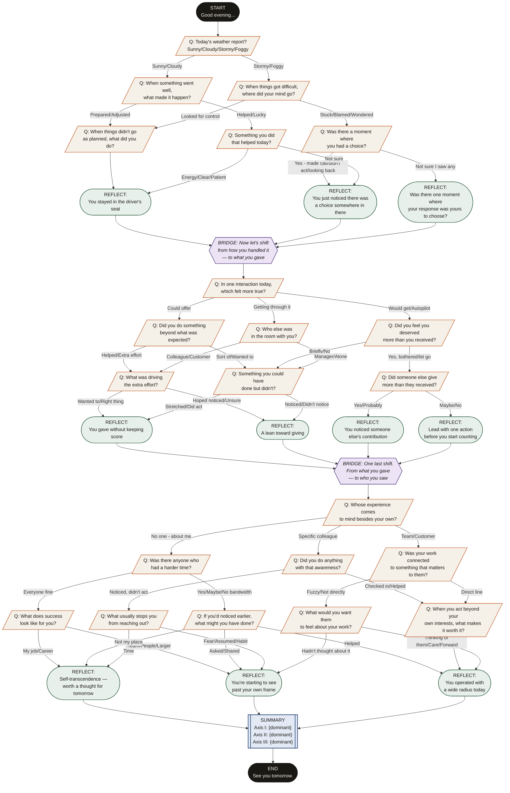

# Reflection Tree — Visual Diagram

## Path Count

The tree produces **24+ distinct conversation paths** depending on answers. Below are the two extreme paths:

### Path A — "Victim / Entitled / Self" (Persona 1)
`START → A1_OPEN(Stormy) → A1_Q1_LOW → A1_Q2_STUCK → A1_R_EXT_STUCK → A2_OPEN(get) → A2_Q1_ENT → A2_Q2_ENT → A2_R_ENT → A3_OPEN(about me) → A3_Q1_SELF → A3_Q2_SELF → A3_R_SELF → SUMMARY → END`

### Path B — "Victor / Contributing / Altrocentric" (Persona 2)
`START → A1_OPEN(Cloudy) → A1_Q1_HIGH → A1_Q2_AGENCY → A1_R_INT → A2_OPEN(offer) → A2_Q1_CONTRIB → A2_Q2_CONTRIB_DEEP → A2_R_CONTRIB → A3_OPEN(colleague) → A3_Q1_COLLEAGUE → A3_Q2_ALTRO → A3_R_ALTRO → SUMMARY → END`
